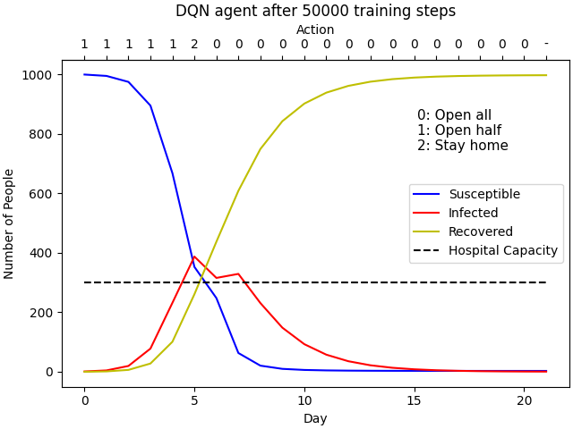

# COVID19_RL

## Setup
The following setup was used in context of macOS.   

Python version 3.7.8   
R version 4.0.2   

After cloning the GitHub repository, create a virtual environment and install the
required packages:   
```console
$ python3 -m venv venv
$ source venv/bin/activate
$ brew install cmake
$ pip install -r requirements.txt
```  
If you have trouble with the Stable Baselines installation, please reference https://stable-baselines.readthedocs.io/en/master/guide/install.html

If rpy2 has been installed correctly, you can now install the required R
packages using the following python script:
```console
$ python installing_packages.py
```  

Now you should be able to run any program in this repository. If you notice any missing python package that is needed, please add it to [requirements.txt](requirements.txt). Similarly, if you notice any R packages that are missing, add them to the `packnames` list in [installing_packages.py](installing_packages.py).

## COVID19_agents
This folder contains agents that train on `COVID19_env` environments. As a simple example, there is a DQN agent from Stable Baselines ([DQN_simple_SIR.py](COVID19_agents/DQN_simple_SIR.py)). To train this agent and test it on the simple SIR environment, simply run the python script:
```console
$ cd COVID19_agents
$ python DQN_simple_SIR.py
```   

Stable Baselines agents support the use of Tensorboard to monitor results. To monitor training progress while training an agent, run the following in a separate terminal:
```console
$ tensorboard --logdir ./DQN_SIR_tensorboard/
```  
In general, replace `./DQN_SIR_tensorboard/` with whatever name is specified for `tensorboard_log` in the agent's `.py` file.

#### Resources
- Stable Baselines DQN agents: https://stable-baselines.readthedocs.io/en/master/modules/dqn.html

#### Files
- [DQN_simple_SIR.py](COVID19_agents/DQN_simple_SIR.py) trains a Stable Baselines DQN agent on the `simple_SIR_env` environment.
- [A2C_SEIR.py](COVID19_agents/A2C_simple_SIR.py) trains a Stable Baselines A2C agent on the `SEIR_env` environment.


## COVID19_env
This folder contains RL environments for COVID-19, which are used to train agents in `COVID19_agents`.  

These environments are written in Python but utilize dynamics models written in
`R` (e.g. [SIR_example.R](COVID19_models/SIR_example.R)). The conversions between Python and R are handled by `rpy2`. See the [rpy2_examples](rpy2_examples/) folder for examples.

#### Resources
- rpy2 documentation: https://rpy2.github.io/doc/latest/html/index.html
- Creating custom environments in Stable Baselines: https://stable-baselines.readthedocs.io/en/master/guide/custom_env.html


#### Files
- [check_env.py](COVID19_env/check_env.py) uses a Stable Baselines function, `check_env`, to check that a given custom environment follows the gym interface
- [simple_SIR_env.py](COVID19_env/simple_SIR_env.py) is an environment that uses dynamics defined by [SIR_example.R](COVID19_models/SIR_example.R) to simulate the cost (health cost + economic cost) for a given action (open everything, open halfway, stay at home) in a given state (SIR totals).
- [SEIR_env.py](COVID19_env/SEIR_env.py) is an environment that uses dynamics defined by [seir_r.R](COVID19_models/SEIR/seir_r.R) to simulate the spread of COVID-19 within and between 14 cities.
- [opt_hyp.py](COVID19_env/opt_hyp.py) uses Optuna to attempt to optimize the hyperparameters of an agent on a given environment. However, this has not been successful thus far for this project.


## Results
This folder contains images/plots of training results.

DQN SIR results:



#### Resources
- Logging results with Tensorboard https://stable-baselines.readthedocs.io/en/master/guide/tensorboard.html

#### Files
- `DQN_simple_SIR_results#.png` shows a [DQN_simple_SIR.py](COVID19_agents/DQN_simple_SIR.py) agent's performance during one simulated episode in the [simple_SIR_env.py](COVID19_env/simple_SIR_env.py) environment after the agent has trained for `#` training steps.
- [DQN_SIR_reward_results.png](Results/DQN_SIR_reward_results.png) shows the progress of a [DQN_simple_SIR.py](COVID19_agents/DQN_simple_SIR.py) agent in the [simple_SIR_env.py](COVID19_env/simple_SIR_env.py) environment during training

## COVID19_models
This folder contains COVID19 spread models in `R` to be used in the RL environments.

For example, a simple SIR model is implemented in [SIR_example.R](COVID19_models/SIR_example.R) and can be tested by running [call_model.py](COVID19_models/call_model.py).
```console
$ cd COVID19_models
$ python call_model.py
```
#### Resources
- SIR model tutorial https://rpubs.com/choisy/sir

#### Files
- [call_model.py](COVID19_models/call_model.py) calls [SIR_example.R](COVID19_models/SIR_example.R) to test it as a stand-alone model
- [SIR_example.R](COVID19_models/SIR_example.R) is an R implementation of an SIR model of disease spread that is used in [simple_SIR_env.py](COVID19_env/simple_SIR_env.py) (source: https://rpubs.com/choisy/sir)
- For SEIR folder, see https://github.com/UW-THINKlab/SEIR/

## rpy2_examples
This folder is to test `rpy2`, such as calling custom R functions from Python.     
Some custom R functions are located in [testFunc.R](rpy2_examples/testFunc.R). They are called by running the Python file [call_testFunc.py](rpy2_examples/call_testFunc.py).
```console
$ cd rpy2_examples
$ python call_testFunc.py
```

#### Resources
rpy2 docuentation: https://rpy2.github.io/doc/latest/html/index.html

#### Files
- [call_testFunc.py](rpy2_examples/call_testFunc.py) calls [testFunc.R](rpy2_examples/testFunc.R) to check that rpy2 can call R functions in Python
- [print_version.py](rpy2_examples/print_version.py) prints the installed version of rpy2
- [testFunc.R](rpy2_examples/testFunc.R) contains two simple R functions for testing purposes

## stable_baselines_examples
This folder contains relevant Stable Baselines RL examples for reference when
working on our COVID-19 RL implementation.  

*Note:* When using Stable Baselines, you may get many warnings about future versions of some python packages, but from my experience, you can ignore these warnings. Currently working on resolving this.  

#### Resources
- Stable Baselines documentation https://stable-baselines.readthedocs.io/en/master/  
- Stable Baselines custom environments https://stable-baselines.readthedocs.io/en/master/guide/custom_env.html
- DQN CartPole example https://stable-baselines.readthedocs.io/en/master/modules/dqn.html#example
- Soccer environment example https://github.com/openai/gym-soccer
- Another good custom environment example (CartPole) https://github.com/openai/gym/blob/master/gym/envs/classic_control/cartpole.py


#### Files
- [customEnv_skeleton.py](stable_baselines_examples/customEnv_skeleton.py) outlines the general structure of a custom environment in Stable Baselines. It is not meant to run.
- [DQN_CartPole.py](stable_baselines_examples/DQN_CartPole.py) is a Stable Baselines DQN imlementation of the classic Cart Pole example
- [soccer_env_example.py](stable_baselines_examples/soccer_env_example.py) is an example of a custom environment for soccer
